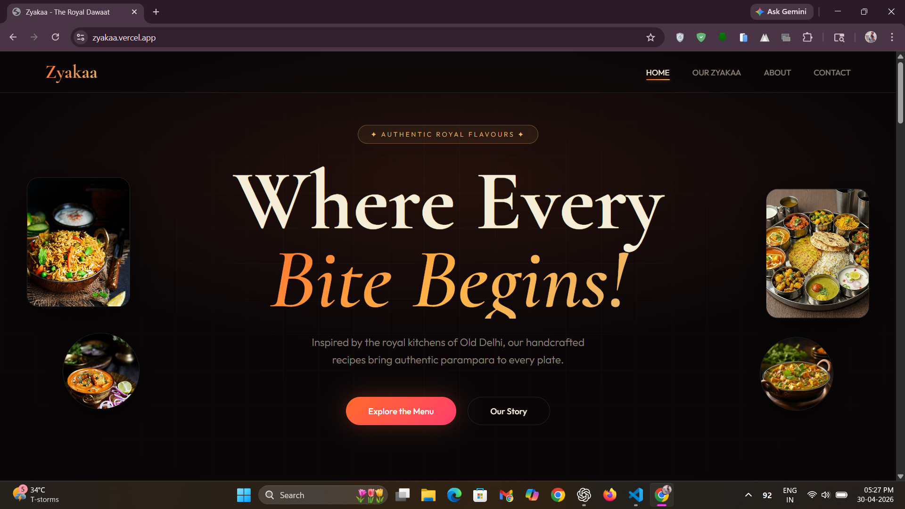
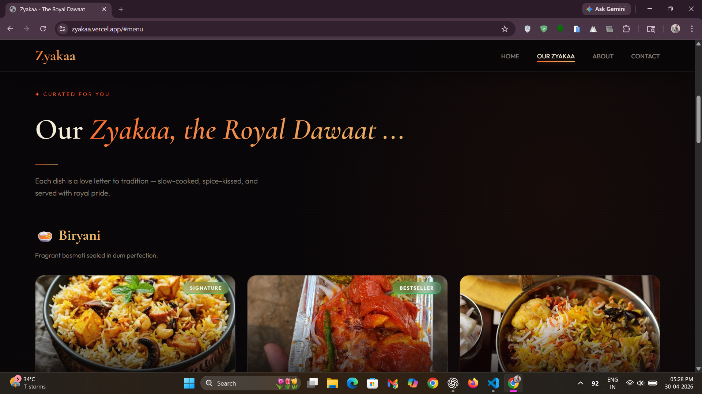
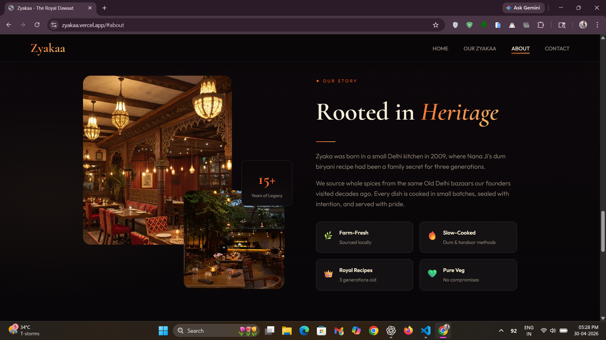
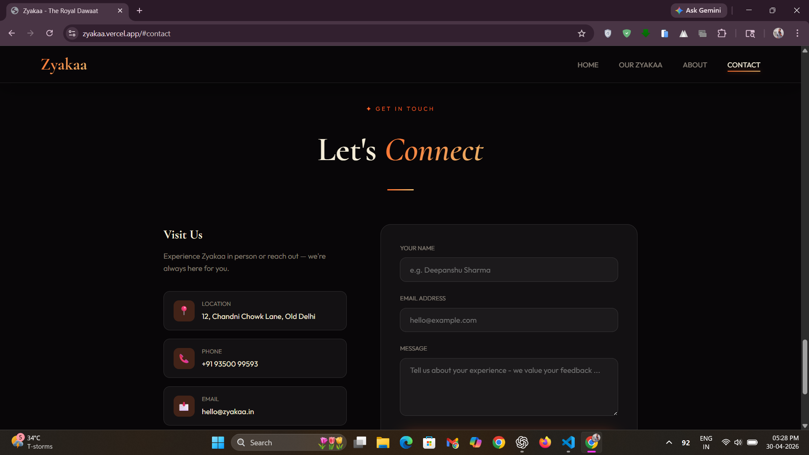

# 🍽️ Zyakaa - The Royal Dawaat


## 📖 Introduction

Welcome to **Zyakaa**, a visually stunning and appetizing restaurant web interface. Designed to highlight rich culinary offerings - like Biryani, Shahi Paneer and traditional Thalis, this project focuses on delivering a premium user experience through cutting-edge web design aesthetics. 

🚀 **Live Demo :** [enjoy our zyakaa!](https://zyakaa.vercel.app/)

## 🎯 Interactive and Modern UI

- **🧭 Seamless Navigation:** Smooth flow with an intuitive, easy-to-use layout.
- **✨ Dynamic Interactions:** Subtle hover effects and micro-animations enhance engagement.
- **📱 Fully Responsive:** Optimized for a consistent experience across all devices.
- **⚡ Instant Feedback:** Quick visual responses to every user action.

## 💎 Sleek & Glassmorphic Design

- **🪞 Frosted Glass Effect:** Translucent layers with blur for depth and elegance.
- **🎨 Vibrant Gradients:** Rich color blends that elevate visual appeal.
- **🖋️ Elegant Typography:** Clean, readable fonts with a premium feel.
- **☁️ Soft Shadows & Borders:** Rounded edges with subtle shadows for a polished look.

## 🛠️ Tech Stack

This project is built using core web technologies, keeping it lightweight and incredibly fast:
- **HTML5:** For semantic structure and content layout.
- **CSS3:** For styling, custom animations, and complex glassmorphism effects.
- **JavaScript (Vanilla):** For dynamic interactions and DOM manipulation.

## 📸 Screenshots

### 🏠 Home

*Landing section with a premium hero layout, animations, and call-to-action.*

### 🍛 Our Zyakaa

*Curated menu display with interactive food cards and smooth hover effects.*

### 📜 About

*Story-driven section highlighting heritage with layered visuals.*

### 📩 Contact

*Clean contact interface with user-friendly form and details.*

## 💻 Setup & Installation

To explore and run this project locally on your machine, follow these simple steps:

1.  **Clone the repository:**
    ```bash
    git clone https://github.com/deepanshu1420/Zyakaa.git
    ```

2.  **Navigate to the project directory:**
    ```bash
    cd zyakaa
    ```

3.  **Run the application:**
    Simply open the `index.html` file in your preferred web browser to view the site. No local server, `npm` installs, or build steps are required!

*Developed by Deepanshu Sharma*